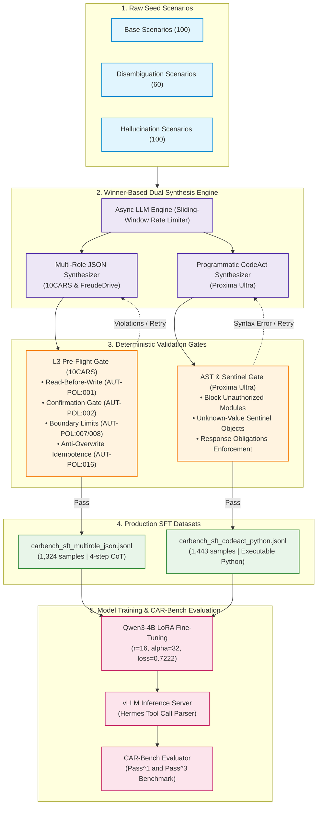
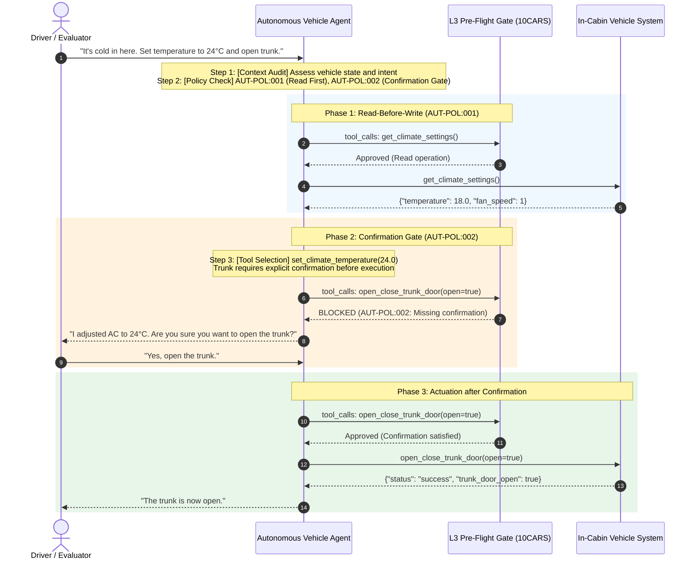
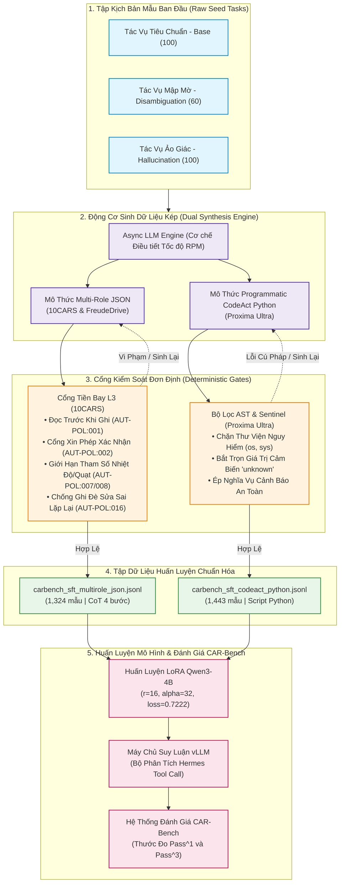
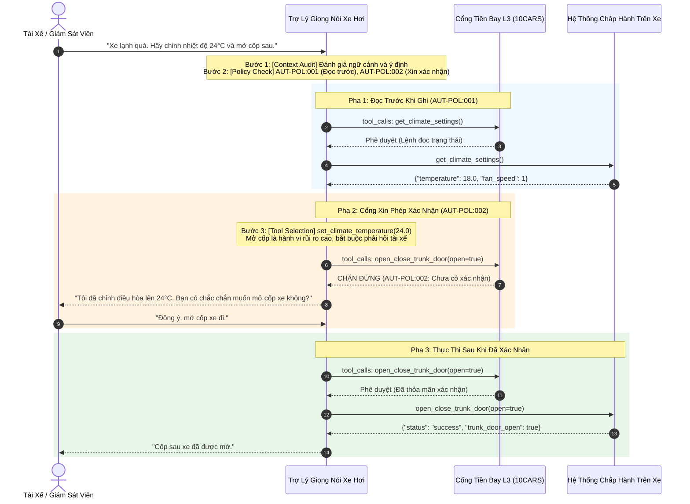

# CAR-Bench Winner-Inspired SFT Data Generator

[English](#english) | [Tiếng Việt](#tiếng-việt)

---

## English

A high-throughput data synthesis engine for autonomous vehicle voice assistants on CAR-Bench (IJCAI 2026). This repository extracts architectural guardrails from the top competition solutions (10CARS, FreudeDrive, and Proxima Ultra) and compiles them into supervised fine-tuning trajectories for compact open-weights language models.

### System Architecture & Data Pipeline



---

### Execution Flow & Safety Invariants



---

### Architectural Foundations

#### 1. 10CARS: Compiled Constitution and Pre-Flight Gate
Probabilistic language models fail safety constraints under three-trial repeatability ($Pass^3$). The 10CARS architecture establishes that safety policies belong in deterministic code rather than prompt tokens.
* **Read-Before-Write (`AUT-POL:001`)**: The agent must inspect vehicle state through `get_*` calls before issuing any `set_*` command.
* **Confirmation Gate (`AUT-POL:002`)**: High-impact operations (opening trunk, sending emails, activating high beams) require explicit driver confirmation before dispatch.
* **Actuator Boundaries (`AUT-POL:007/008`)**: Actuator requests exceeding operational limits ($16.0 \le T \le 28.0^\circ\text{C}$, fan speed $0 \le v \le 7$) trigger immediate validation failure.
* **Anti-Churn Gate (`AUT-POL:016`)**: Rejects duplicate consecutive setter calls with identical parameters.

#### 2. FreudeDrive: Multi-Role Concurrent Wave
Sequential tool calling creates cumulative response latency. FreudeDrive splits trajectory planning across specialized concurrent modules:
* **Four-Step `<think>` Chain**: Every assistant turn executes `[Context Audit]` $\to$ `[Policy Check]` $\to$ `[Tool Selection & Provenance]` $\to$ `[Execution Plan]`.
* **Parameter Provenance**: Eliminates hallucinated tool parameters. Every parameter value must resolve directly to context history or driver utterances.

#### 3. Proxima Ultra: Programmatic CodeAct and Policy-as-Code
Interactive tool turns introduce cascading errors over long task horizons. Proxima Ultra generates executable Python scripts:
* **Coroutine Bridge**: Collapses deep multi-tool execution chains into two model calls.
* **Sentinel Handlers**: Intercepts `"unknown"` sensor signals to trigger safe conversational fallback rather than ungrounded assumptions.
* **Response Obligations**: Injects mandatory driver notifications whenever environmental changes cross safety thresholds.

---

### Repository Structure

```
carbench_data_generator/
├── data/
│   └── new_data/
│       ├── carbench_sft_multirole_json.jsonl   # 1,324 multi-role JSON records with 4-step CoT
│       └── carbench_sft_codeact_python.jsonl   # 1,443 programmatic CodeAct Python records
├── sft_generator/
│   ├── config.py                               # Concurrency limits, timeouts, and paths
│   ├── schemas.py                              # Official 57 CAR-bench tool definitions
│   ├── generator.py                            # Async worker orchestrator and file writers
│   ├── async_engine.py                         # Streaming HTTP client with rate limiting
│   ├── main.py                                 # Command-line entrypoint
│   ├── upload_to_hf.py                         # Hugging Face dataset publishing utility
│   ├── prompts/
│   │   ├── multi_role_json_prompt.py           # Multi-role CoT synthesis prompt templates
│   │   └── codeact_python_prompt.py            # CodeAct Policy-as-Code synthesis templates
│   └── validators/
│       ├── pre_flight_gate.py                  # Deterministic L1-L3 rule validation
│       └── codeact_validator.py                # Python AST and sentinel object validation
├── scripts/
│   ├── sanitize_dataset.py                     # Schema normalization and ID generator
│   ├── upload_all_hf.py                        # Hugging Face model uploader
│   ├── run_vllm_all.sh                         # vLLM inference server launcher
│   ├── run_bench_base.sh                       # Base benchmark runner
│   ├── run_bench_disambig.sh                   # Disambiguation benchmark runner
│   └── run_bench_hallu.sh                      # Hallucination benchmark runner
├── run_pipeline.sh                             # Single-command setup and generation runner
├── pyproject.toml                              # Package metadata and dependencies
└── README.md                                   # Project documentation
```

---

### Quickstart (Single-Command Execution)

Run environment synchronization and dataset sanitization:

```bash
chmod +x run_pipeline.sh
./run_pipeline.sh
```

#### Option A: Running with Local Self-Hosted Model (No External API Key)

If you have a local model or server instance (such as vLLM, Ollama, or local checkpoints):

1. Launch your local vLLM server:
```bash
# Serve fine-tuned weights locally on port 8000
./run_pipeline.sh serve-vllm upwitu/qwen3-4b-sft-all 8000
```

2. Run generation against the local endpoint:
```bash
# Synthesize datasets against local endpoint without rate limits
./run_pipeline.sh local upwitu/qwen3-4b-sft-all 8000
```

#### Option B: Running with Cloud API Providers

To run targeted synthesis pipelines against OpenAI-compatible APIs:

```bash
# Generate Multi-Role JSON dataset
./run_pipeline.sh multirole

# Generate Programmatic CodeAct Python dataset
./run_pipeline.sh codeact

# Run full pipeline with custom concurrency
CONCURRENCY=40 VARIATIONS=10 ./run_pipeline.sh all
```

Configure parameters in `.env`:

```ini
# Hugging Face Settings
HF_TOKEN=your_token_here
HF_DATASET_REPO=upwitu/carbench_sft_winner_dataset

# Local Server Setup (No API Key Required)
# OPENAI_API_BASE=http://localhost:8000/v1
# OPENAI_API_KEY=EMPTY
# CAR_BENCH_MODEL=upwitu/qwen3-4b-sft-all

# External API Provider Setup
OPENAI_API_BASE=https://api.deepseek.com/v1
OPENAI_API_KEY=your_api_key_here
CAR_BENCH_MODEL=deepseek-v4-flash

# Generation Limits
CONCURRENCY_LIMIT=30
VARIATIONS_PER_TASK=10
```

---

### Model Artifacts and Benchmark Evaluation

Fine-tuned model weights are available on Hugging Face:
* **LoRA Adapter**: [`upwitu/qwen3-4b-sft-all-lora`](https://huggingface.co/upwitu/qwen3-4b-sft-all-lora)
* **Merged BF16 Weights**: [`upwitu/qwen3-4b-sft-all`](https://huggingface.co/upwitu/qwen3-4b-sft-all)

#### Running the vLLM Evaluation Server
```bash
bash scripts/run_vllm_all.sh
```

#### Running Benchmark Suites
```bash
export OPENAI_API_KEY="your-evaluator-openai-key"
bash scripts/run_bench_base.sh
bash scripts/run_bench_disambig.sh
bash scripts/run_bench_hallu.sh
```

---

## Tiếng Việt

Hệ thống sinh dữ liệu huấn luyện SFT hiệu năng cao cho trợ lý giọng nói trên xe hơi theo chuẩn đánh giá CAR-Bench (IJCAI 2026). Kho lưu trữ chắt lọc các giải pháp kỹ thuật từ ba đội tuyển vô địch (10CARS, FreudeDrive, và Proxima Ultra), đóng gói thành tập dữ liệu mẫu chuẩn hóa cho mô hình ngôn ngữ mở kích thước nhỏ.

### Kiến Trúc Hệ Thống & Pipeline Sinh Dữ Liệu



---

### Luồng Xử Lý Lượt Thoại & Kiểm Định Quy Tắc An Toàn L3



---

### Nền Tảng Kiến Trúc

#### 1. 10CARS: Cổng Kiểm Soát Xuất Xưởng (Pre-Flight Gate)
Mô hình ngôn ngữ sinh xác suất thường vi phạm quy tắc an toàn khi đánh giá lặp 3 lần độc lập ($Pass^3$). 10CARS khẳng định chính sách an toàn phải nằm trong mã nguồn thực thi:
* **Đọc Trước Khi Ghi (`AUT-POL:001`)**: Bắt buộc đọc trạng thái xe qua các lệnh `get_*` trước khi thực thi lệnh thay đổi `set_*`.
* **Cổng Xác Nhận (`AUT-POL:002`)**: Thao tác rủi ro cao (mở cốp xe, gửi thư điện tử, bật đèn pha chiếu xa) bắt buộc xin phép tài xế trước khi chạy.
* **Giới Hạn Thông Số (`AUT-POL:007/008`)**: Kiểm tra trực tiếp giới hạn vận hành ($16.0 \le T \le 28.0^\circ\text{C}$, quạt gió $0 \le v \le 7$).
* **Chống Ghi Đè Lặp Lại (`AUT-POL:016`)**: Chặn các lệnh ghi đè liên tiếp có cùng thông số.

#### 2. FreudeDrive: Phân Vai Đồng Thời (Multi-Role Concurrency)
Thực thi công cụ tuần tự làm tăng thời gian chờ của tài xế. FreudeDrive phân tách quy trình xử lý thành các luồng song song:
* **Chuỗi `<think>` 4 bước**: Mỗi phản hồi của trợ lý tuân thủ `[Context Audit]` $\to$ `[Policy Check]` $\to$ `[Tool Selection & Provenance]` $\to$ `[Execution Plan]`.
* **Nguồn Gốc Tham Số**: Loại bỏ việc tự bịa tham số công cụ. Mọi giá trị tham số phải trích xuất trực tiếp từ lịch sử hoặc lời nói của tài xế.

#### 3. Proxima Ultra: Lập Trình Thực Thi (CodeAct) và Chính Sách Trong Mã
Thay thế vòng lặp gọi công cụ tương tác bằng kịch bản Python hoàn chỉnh:
* **Cầu Nối Coroutine**: Gom chuỗi gọi công cụ phức tạp từ 7 lượt gọi mô hình xuống còn 2 lượt.
* **Bộ Bắt Sentinel**: Chặn tín hiệu cảm biến trả về `"unknown"` để chuyển sang hỏi lại tài xế an toàn thay vì tự suy đoán.
* **Nghĩa Vụ Cảnh Báo**: Tự động chèn cảnh báo âm thanh khi các chỉ số vượt ngưỡng tiện nghi.

---

### Hướng Dẫn Vận Hành Nhanh (1 Lệnh Duy Nhất)

Đồng bộ môi trường và chuẩn hóa dữ liệu:

```bash
chmod +x run_pipeline.sh
./run_pipeline.sh
```

#### Lựa Chọn A: Chạy Bằng Mô Hình Nội Bộ Trên Server (Không Cần API Bên Ngoài)

Dành cho kịch bản người dùng đã có sẵn checkpoint hoặc máy chủ mô hình nội bộ (vLLM, Ollama, Hugging Face checkpoint):

1. Khởi chạy máy chủ suy luận vLLM trên GPU:
```bash
# Phục vụ trọng số fine-tune tại cổng 8000
./run_pipeline.sh serve-vllm upwitu/qwen3-4b-sft-all 8000
```

2. Chạy sinh dữ liệu trực tiếp với endpoint nội bộ:
```bash
# Sinh tập dữ liệu qua endpoint nội bộ, bỏ qua giới hạn tốc độ RPM
./run_pipeline.sh local upwitu/qwen3-4b-sft-all 8000
```

#### Lựa Chọn B: Chạy Bằng API Nhà Cung Cấp Cloud

Chạy từng chế độ sinh dữ liệu riêng biệt thông qua cổng API tương thích OpenAI:

```bash
# Sinh tập dữ liệu Multi-Role JSON
./run_pipeline.sh multirole

# Sinh tập dữ liệu CodeAct Python
./run_pipeline.sh codeact

# Chạy toàn bộ luồng với cấu hình luồng tùy biến
CONCURRENCY=40 VARIATIONS=10 ./run_pipeline.sh all
```

Cấu hình các tham số qua tệp `.env`:

```ini
# Cấu hình Hugging Face
HF_TOKEN=your_token_here
HF_DATASET_REPO=upwitu/carbench_sft_winner_dataset

# Cấu hình Server Nội Bộ (Không yêu cầu API Key)
# OPENAI_API_BASE=http://localhost:8000/v1
# OPENAI_API_KEY=EMPTY
# CAR_BENCH_MODEL=upwitu/qwen3-4b-sft-all

# Cấu hình API Cloud
OPENAI_API_BASE=https://api.deepseek.com/v1
OPENAI_API_KEY=your_api_key_here
CAR_BENCH_MODEL=deepseek-v4-flash

# Giới hạn sinh dữ liệu
CONCURRENCY_LIMIT=30
VARIATIONS_PER_TASK=10
```

---

### Mô Hình Huấn Luyện và Đánh Giá Benchmark

Các mô hình tinh chỉnh từ tập dữ liệu được lưu trữ trên Hugging Face:
* **LoRA Adapter**: [`upwitu/qwen3-4b-sft-all-lora`](https://huggingface.co/upwitu/qwen3-4b-sft-all-lora)
* **Trọng Số Hợp Nhất BF16**: [`upwitu/qwen3-4b-sft-all`](https://huggingface.co/upwitu/qwen3-4b-sft-all)

#### Chạy Máy Chủ vLLM
```bash
bash scripts/run_vllm_all.sh
```

#### Chạy Bộ Kiểm Thử CAR-Bench
```bash
export OPENAI_API_KEY="your-evaluator-openai-key"
bash scripts/run_bench_base.sh
bash scripts/run_bench_disambig.sh
bash scripts/run_bench_hallu.sh
```
